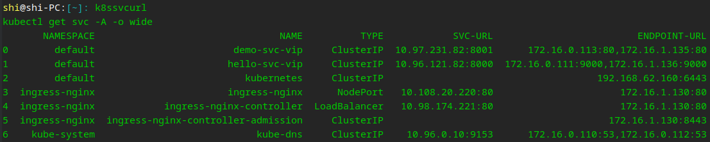
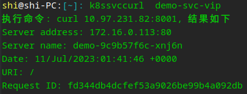
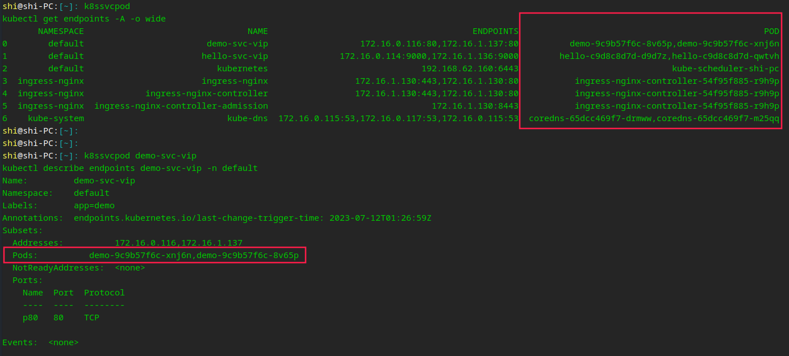
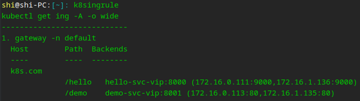

[GitHub](https://github.com/shigebeyond/k8scmd) | [Gitee](https://gitee.com/shigebeyond/k8scmd)

# k8scmd - k8s命令精简版
## 概述
k8s命令很多，难记又难打，非常艰难；
我直接用python做了一个简化版的命令，易记又易打，非常简单；
同时对资源相关的命令，会自动填充资源的命名空间，不用用户操心也不用写。

- 目前仅支持linux环境，windows环境未测试

## 安装
```
pip install k8scmd
```

## 使用
1. k8sstart: 启动 kubelet 服务
```
k8sstart
```

1. k8sstop: 停止 kubelet 服务
```
k8sstop
```

2. k8sall: 查看所有资源
```sh
k8sall
```

3. k8sns: 查看或删除 Namespace
```sh
# 查看所有Namespace资源列表
k8sns
k8sns -o yaml
# 查看单个Namespace资源详情
k8sns 资源名
k8sns 资源名 -o yaml
# 删除单个Namespace资源
k8sns 资源名 -d
# 编辑单个Namespace资源
k8sns 资源名 -e
# 过滤指定标签的Namespace资源列表，以下2个命令等价
k8sns @nginx
k8sns -l app=nginx
```

4. k8sno: 查看或删除 Node
```sh
# 查看所有Node资源列表
k8sno
k8sno -o yaml
# 查看单个Node资源详情
k8sno 资源名
k8sno 资源名 -o yaml
# 删除单个Node资源
k8sno 资源名 -d
# 编辑单个Node资源
k8sno 资源名 -e
# 过滤指定标签的Node资源列表，以下2个命令等价
k8sno @nginx
k8sno -l app=nginx
```

5. k8spod: 查看或删除 Pod
```sh
# 查看所有Pod资源列表
k8spod
k8spod -o yaml
# 查看单个Pod资源详情
k8spod 资源名
k8spod 资源名 -o yaml
# 删除单个Pod资源
k8spod 资源名 -d
# 编辑单个Pod资源
k8spod 资源名 -e
# 过滤指定标签的Pod资源列表，以下2个命令等价
k8spod @nginx
k8spod -l app=nginx
```

6. k8ssvc: 查看或删除 Service
```sh
# 查看所有Service资源列表
k8ssvc
k8ssvc -o yaml
# 查看单个Service资源详情
k8ssvc 资源名
k8ssvc 资源名 -o yaml
# 删除单个Service资源
k8ssvc 资源名 -d
# 编辑单个Service资源
k8ssvc 资源名 -e
# 过滤指定标签的Service资源列表，以下2个命令等价
k8ssvc @nginx
k8ssvc -l app=nginx
```

7. k8ssvcurl: 查看所有Service的服务url+终端url，方便用户复制url
```sh
k8ssvcurl 
```


8. k8ssvccurl: 对指定Service的服务url执行curl命令
```sh
k8ssvccurl 服务名
```


9. k8ssvcpod: 查看Service的终端对应的pod
```sh
# 查看所有Service的终端对应的pod
k8ssvcpod
# 查看单个Service的终端对应的pod
k8ssvcpod 服务名
```


10. k8src: 查看或删除 ReplicationController
```sh
# 查看所有ReplicationController资源列表
k8src
k8src -o yaml
# 查看单个ReplicationController资源详情
k8src 资源名
k8src 资源名 -o yaml
# 删除单个ReplicationController资源
k8src 资源名 -d
# 编辑单个ReplicationController资源
k8src 资源名 -e
# 过滤指定标签的ReplicationController资源列表，以下2个命令等价
k8src @nginx
k8src -l app=nginx
```

11. k8srs: 查看或删除 ReplicaSet
```sh
# 查看所有ReplicaSet资源列表
k8srs
k8srs -o yaml
# 查看单个ReplicaSet资源详情
k8srs 资源名
k8srs 资源名 -o yaml
# 删除单个ReplicaSet资源
k8srs 资源名 -d
# 编辑单个ReplicaSet资源
k8srs 资源名 -e
# 过滤指定标签的ReplicaSet资源列表，以下2个命令等价
k8srs @nginx
k8srs -l app=nginx
```

12. k8sds: 查看或删除 DaemonSet
```sh
# 查看所有DaemonSet资源列表
k8sds
k8sds -o yaml
# 查看单个DaemonSet资源详情
k8sds 资源名
k8sds 资源名 -o yaml
# 删除单个DaemonSet资源
k8sds 资源名 -d
# 编辑单个DaemonSet资源
k8sds 资源名 -e
# 过滤指定标签的DaemonSet资源列表，以下2个命令等价
k8sds @nginx
k8sds -l app=nginx
```

13. k8ssts: 查看或删除 StatefulSet
```sh
# 查看所有StatefulSet资源列表
k8ssts
k8ssts -o yaml
# 查看单个StatefulSet资源详情
k8ssts 资源名
k8ssts 资源名 -o yaml
# 删除单个StatefulSet资源
k8ssts 资源名 -d
# 编辑单个StatefulSet资源
k8ssts 资源名 -e
# 过滤指定标签的StatefulSet资源列表，以下2个命令等价
k8ssts @nginx
k8ssts -l app=nginx
```

14. k8sdeploy: 查看或删除 Deployment
```sh
# 查看所有Deployment资源列表
k8sdeploy
k8sdeploy -o yaml
# 查看单个Deployment资源详情，等价于 kubectl describe deployment 资源名 + kubectl rollout status deployment 资源名
k8sdeploy 资源名
k8sdeploy 资源名 -o yaml
# 删除单个Deployment资源
k8sdeploy 资源名 -d
# 编辑单个Deployment资源
k8sdeploy 资源名 -e
# 过滤指定标签的Deployment资源列表，以下2个命令等价
k8sdeploy @nginx
k8sdeploy -l app=nginx

# 暂停 Deployment 的部署操作，等价于 kubectl rollout pause deploy 资源名
k8sdeploy 资源名 stop
# 恢复 Deployment 的部署操作，等价于 kubectl rollout resume deploy 资源名
k8sdeploy 资源名 start
# 重启 Deployment 的部署操作，即重启pod，等价于 kubectl rollout restart deploy 资源名
k8sdeploy 资源名 restart
```

15. k8shpa: 查看或删除 HorizontalPodAutoscaler
```sh
# 查看所有HorizontalPodAutoscaler资源列表
k8shpa
k8shpa -o yaml
# 查看单个HorizontalPodAutoscaler资源详情
k8shpa 资源名
k8shpa 资源名 -o yaml
# 删除单个HorizontalPodAutoscaler资源
k8shpa 资源名 -d
# 编辑单个HorizontalPodAutoscaler资源
k8shpa 资源名 -e
# 过滤指定标签的HorizontalPodAutoscaler资源列表，以下2个命令等价
k8shpa @nginx
k8shpa -l app=nginx
```

16. k8sconfig: 查看或删除 ConfigMap
```sh
# 查看所有ConfigMap资源列表
k8sconfig
k8sconfig -o yaml
# 查看单个ConfigMap资源详情
k8sconfig 资源名
k8sconfig 资源名 -o yaml
# 删除单个ConfigMap资源
k8sconfig 资源名 -d
# 编辑单个ConfigMap资源
k8sconfig 资源名 -e
# 过滤指定标签的ConfigMap资源列表，以下2个命令等价
k8sconfig @nginx
k8sconfig -l app=nginx
```

17. k8ssecret: 查看或删除 Secret
```sh
# 查看所有Secret资源列表
k8ssecret
k8ssecret -o yaml
# 查看单个Secret资源详情
k8ssecret 资源名
k8ssecret 资源名 -o yaml
# 删除单个Secret资源
k8ssecret 资源名 -d
# 编辑单个Secret资源
k8ssecret 资源名 -e
# 过滤指定标签的Secret资源列表，以下2个命令等价
k8ssecret @nginx
k8ssecret -l app=nginx
```

18. k8sendpoint: 查看或删除 Endpoint
```sh
# 查看所有Endpoint资源列表
k8sendpoint
k8sendpoint -o yaml
# 查看单个Endpoint资源详情
k8sendpoint 资源名
k8sendpoint 资源名 -o yaml
# 删除单个Endpoint资源
k8sendpoint 资源名 -d
# 编辑单个Endpoint资源
k8sendpoint 资源名 -e
# 过滤指定标签的Endpoint资源列表，以下2个命令等价
k8sendpoint @nginx
k8sendpoint -l app=nginx
```

19. k8sevent: 查看或删除 Event
```sh
# 查看所有Event资源列表
k8sevent
k8sevent -o yaml
# 查看单个Event资源详情
k8sevent 资源名
k8sevent 资源名 -o yaml
# 删除单个Event资源
k8sevent 资源名 -d
# 编辑单个Event资源
k8sevent 资源名 -e
# 过滤指定标签的Event资源列表，以下2个命令等价
k8sevent @nginx
k8sevent -l app=nginx
```

20. k8sjob: 查看或删除 Job
```sh
# 查看所有Job资源列表
k8sjob
k8sjob -o yaml
# 查看单个Job资源详情
k8sjob 资源名
k8sjob 资源名 -o yaml
# 删除单个Job资源
k8sjob 资源名 -d
# 编辑单个Job资源
k8sjob 资源名 -e
# 过滤指定标签的Job资源列表，以下2个命令等价
k8sjob @nginx
k8sjob -l app=nginx
```

21. k8sing: 查看或删除 Ingress
```sh
# 查看所有Ingress资源列表
k8sing
k8sing -o yaml
# 查看单个Ingress资源详情
k8sing 资源名
k8sing 资源名 -o yaml
# 删除单个Ingress资源
k8sing 资源名 -d
# 编辑单个Ingress资源
k8sing 资源名 -e
# 过滤指定标签的Ingress资源列表，以下2个命令等价
k8sing @nginx
k8sing -l app=nginx
```

22. k8singrule: 查看所有Ingress资源的规则
```sh
k8singrule
```


23. k8scronjob: 查看或删除 Cronjob
```sh
# 查看所有Cronjob资源列表
k8scronjob
k8scronjob -o yaml
# 查看单个Cronjob资源详情
k8scronjob 资源名
k8scronjob 资源名 -o yaml
# 删除单个Cronjob资源
k8scronjob 资源名 -d
# 编辑单个Cronjob资源
k8scronjob 资源名 -e
# 过滤指定标签的Cronjob资源列表，以下2个命令等价
k8scronjob @nginx
k8scronjob -l app=nginx
```

24. k8spv: 查看或删除 PersistentVolume
```sh
# 查看所有PersistentVolume资源列表
k8spv
k8spv -o yaml
# 查看单个PersistentVolume资源详情
k8spv 资源名
k8spv 资源名 -o yaml
# 删除单个PersistentVolume资源
k8spv 资源名 -d
# 编辑单个PersistentVolume资源
k8spv 资源名 -e
# 过滤指定标签的PersistentVolume资源列表，以下2个命令等价
k8spv @nginx
k8spv -l app=nginx
```

25. k8spvc: 查看或删除 PersistentVolumeClaim
```sh
# 查看所有PersistentVolumeClaim资源列表
k8spvc
k8spvc -o yaml
# 查看单个PersistentVolumeClaim资源详情
k8spvc 资源名
k8spvc 资源名 -o yaml
# 删除单个PersistentVolumeClaim资源
k8spvc 资源名 -d
# 编辑单个PersistentVolumeClaim资源
k8spvc 资源名 -e
# 过滤指定标签的PersistentVolumeClaim资源列表，以下2个命令等价
k8spvc @nginx
k8spvc -l app=nginx
```

26. k8ssc: 查看或删除 StorageClass
```sh
# 查看所有StorageClass资源列表
k8ssc
k8ssc -o yaml
# 查看单个StorageClass资源详情
k8ssc 资源名
k8ssc 资源名 -o yaml
# 删除单个StorageClass资源
k8ssc 资源名 -d
# 编辑单个StorageClass资源
k8ssc 资源名 -e
# 过滤指定标签的StorageClass资源列表，以下2个命令等价
k8ssc @nginx
k8ssc -l app=nginx
```

27. k8sexec: 在pod中执行命令
```sh
k8sexec Pod资源名 命令
# 例如
k8sexec nginx ls -l
```

28. k8sbash: 进入pod bash
```sh
k8sbash Pod资源名
# 例如
k8sbash nginx
```

29. k8slog: 查看pod日志
```sh
k8slog Pod资源名 [-f]
# 例如
k8slog nginx
k8slog nginx -f
```

30. k8sletlog: 查看kubelet服务日志
```sh
k8sletlog
k8sletlog -f
```

31. k8screate: 简化`kubectl create -f`命令
```sh
k8screate a.yml b.yml
```

32. k8sapply: 简化`kubectl apply -f`命令
```sh
k8sapply a.yml b.yml
```

33. k8sdelete: 简化`kubectl delete -f`命令
```sh
k8sdelete a.yml b.yml
```

34. k8sdiff: 简化`kubectl diff -f`命令
```sh
k8sdiff a.yml b.yml
```

35. k8sscale: 扩容
```sh
k8sscale Deployment资源名 副本数
```

36. k8shistory: 查看 Deployment 历史记录
```sh
# 查看所有历史版本
k8shistory Deployment资源名
# 查看单个版本详情
k8shistory Deployment资源名 版本号
```

37. k8srollback: 查看 Deployment 历史记录
```sh
# 回滚到上一个版本
k8srollback Deployment资源名
# 回滚到指定版本
k8srollback Deployment资源名 版本号
```

38. k8sgetlabels: 切换是否显示标签，会改写配置文件`~/.kube/k8scmd.yml`, 用于控制全局各个资源列表(即kubectl get命令)的显示
```sh
k8sgetlabels
```

39. k8sgetoutput: 指定输出格式，会改写配置文件`~/.kube/k8scmd.yml`, 用于控制全局各个资源列表(即kubectl get命令)的显示
```sh
# 指定输出格式
k8sgetoutput yaml
# 无指定输出格式，则在wide,yaml之间切换
k8sgetoutput
```

40. k8sgetns: 指定过滤的命名空间，会改写配置文件`~/.kube/k8scmd.yml`, 用于控制全局各个资源列表(即kubectl get命令)的显示
```sh
# 指定过滤的命名空间
k8sgetns yaml
# 无指定过滤的命名空间，则为全部命名空间
k8sgetns
```

41. k8sapi
```
# 查看所有api资源
k8sapi
# 查看资源或字段的文档
k8sapi 资源或字段
# 如 
k8sapi pod
k8sapi pods.spec.containers
```

## 全局配置 
配置文件`~/.kube/k8scmd.yml`, 用于控制全局各个资源列表(即kubectl get命令)的显示
```yaml
# 控制全局各个资源列表的显示
get-output: wide # 输出格式，如wide,yaml,json
get-labels: false # 显示标签
get-ns:  # 命名空间
```